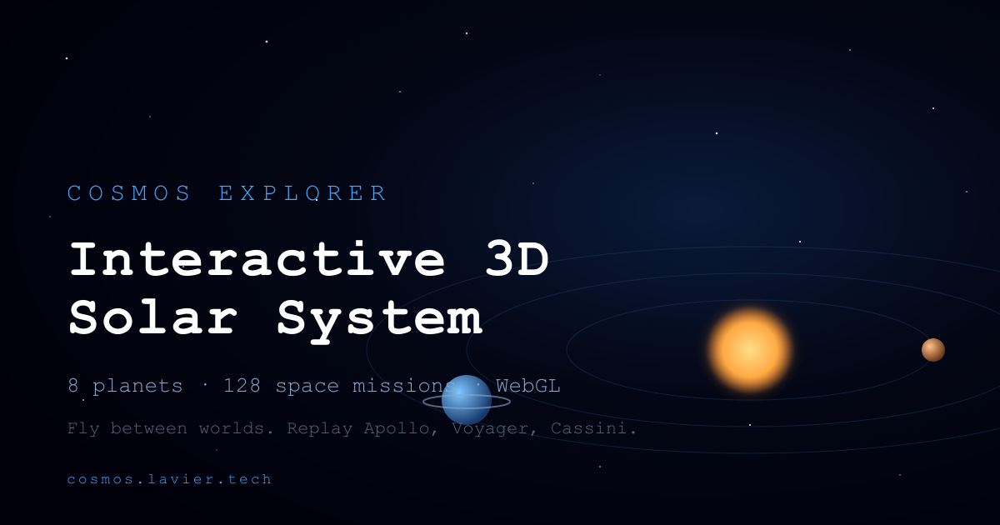

<a id="top"></a>

<p align="right">
  <a href="README.md">Русский</a>
</p>

<p align="center">
  
</p>

<h1 align="center">Cosmos Explorer</h1>

<p align="center">
  <em>Interactive 3D Solar System and space-missions encyclopedia</em><br>
  <em>Next.js 15 + React 19 + Three.js + Go + Connect-RPC + PostgreSQL</em>
</p>

<p align="center">
  
  
  
  
  
  
  
  
  
</p>

<p align="center">
  <a href="https://cosmos.lavier.tech" target="_blank" rel="noopener">
    
  </a>
</p>

<p align="center">
  <a href="#demo">Demo</a>&nbsp;&nbsp;|&nbsp;&nbsp;
  <a href="#about">About</a>&nbsp;&nbsp;|&nbsp;&nbsp;
  <a href="#features">Features</a>&nbsp;&nbsp;|&nbsp;&nbsp;
  <a href="#quick-start">Quick Start</a>&nbsp;&nbsp;|&nbsp;&nbsp;
  <a href="#tech-stack">Tech Stack</a>&nbsp;&nbsp;|&nbsp;&nbsp;
  <a href="#api">API</a>&nbsp;&nbsp;|&nbsp;&nbsp;
  <a href="#testing">Testing</a>&nbsp;&nbsp;|&nbsp;&nbsp;
  <a href="#architecture">Architecture</a>
</p>

---

## Demo

<p align="center">
  <a href="https://cosmos.lavier.tech" target="_blank" rel="noopener">
    
  </a>
  <br>
  <sub>Click the preview to open the live site</sub>
</p>

---

## About

**Cosmos Explorer** is an interactive 3D simulation of the Solar System paired with a space-missions encyclopedia. The **Three.js** scene renders 8 planets with orbital mechanics, interplanetary trajectory simulation, and a live ISS tracker over WebSocket. The content side is **281 statically generated pages** (SSG + ISR): an encyclopedia of **128 missions** and per-planet pages in two languages. The **Go** backend serves data over **Connect-RPC** — a single endpoint speaks gRPC, gRPC-Web, and plain JSON simultaneously. The frontend–backend contract is typed end to end with **Protobuf**: TypeScript clients and Go stubs are generated from one `.proto` schema. Everything ships in **Docker**; deployment is fully automated — GitHub Actions builds images into GHCR and rolls them out to a VPS with a health gate and automatic rollback.

---

## Features

<table>
<tr>
<td valign="top" width="50%">

### Interactive scene

- Real-time 3D Solar System
- 8 planets with orbital mechanics and post-processing (bloom)
- Planet panels: overview, atmosphere, moons, missions
- Interplanetary mission trajectory simulation
- Live ISS tracker (WebSocket, 1 Hz updates)
- Time controls: pause and speed adjustment

</td>
<td valign="top" width="50%">

### Platform

- Encyclopedia of 128 space missions with filters and search
- Two locales: English (default) and Russian, Accept-Language detection
- 281 static pages: SSG + tag-based ISR revalidation
- SEO: JSON-LD, dynamic sitemap, hreflang, per-entity OG images
- PWA with offline mode (Serwist)
- Security: CSP, HSTS, rate limiting, distroless images

</td>
</tr>
</table>

<p align="right"><a href="#top">back to top</a></p>

---

## Quick Start

Prerequisites: Node 22+, Docker + Compose v2. GNU Make is optional but shortens the commands.

```bash
git clone https://github.com/laviercasey/cosmos-explorer.git
cd cosmos-explorer
cp .env.example .env
cp .env.example .env.local
```

```bash
make up            # or: docker compose up -d db api
make migrate-up    # or: docker compose --profile tools run --rm migrate
make seed          # or: docker compose --profile tools run --rm seed

npm install
npm run dev        # http://localhost:3000
```

Smoke-test the API:

```bash
curl http://localhost:8080/healthz
curl -X POST http://localhost:8080/cosmos.v1.CosmosService/ListPlanets \
  -H "Content-Type: application/json" -d '{"limit":3,"lang":"en"}'
```

Production deployment (GitHub Actions → GHCR → VPS), secrets, first-deploy bootstrap, rollback, and backups: [`deploy/README.md`](deploy/README.md)

<details>
<summary>Services and ports</summary>

<br>

| Service | Port | Purpose |
|:--|:--|:--|
| **cosmos-frontend** | `3000` | Next.js 15 standalone |
| **cosmos-api** | `8080` | Go + Connect-RPC + WebSocket |
| **cosmos-db** | `5432` (local) | PostgreSQL 16 |

</details>

<details>
<summary>Key environment variables (.env)</summary>

<br>

| Variable | Description | Default |
|:--|:--|:--|
| `DATABASE_URL` | PostgreSQL connection string (pgx) | - |
| `API_INTERNAL_URL` | API address for Next.js server-side fetches | `http://cosmos-api:8080` |
| `NEXT_PUBLIC_SITE_URL` | Public site URL (canonical, OG, sitemap) | - |
| `NEXT_PUBLIC_API_BASE_URL` | Public API address for the browser | - |
| `REVALIDATE_SECRET` | Secret for `POST /api/revalidate` (ISR invalidation) | - |
| `NEXT_PUBLIC_GOOGLE_VERIFICATION` | Google Search Console meta tag | empty |
| `NEXT_PUBLIC_YANDEX_VERIFICATION` | Yandex Webmaster meta tag | empty |
| `NEXT_PUBLIC_UMAMI_SRC` / `_WEBSITE_ID` / `_ALLOWED_HOSTS` | Self-hosted Umami analytics | empty |
| `CONNECT_RATE_RPS` / `CONNECT_RATE_BURST` | Per-IP rate limiting for RPC endpoints | `20` / `40` |
| `WS_RATE_RPS` / `WS_RATE_BURST` | Rate limiting for WebSocket connections | `3` / `5` |
| `IMAGE_PREFIX` / `IMAGE_TAG` | GHCR images for the production stack | - / `latest` |

Full list: [`.env.example`](.env.example) and [`.env.prod.example`](.env.prod.example).

</details>

<details>
<summary>First production run (VPS)</summary>

<br>

Before the first `push` to `main`, run once on the VPS:

```bash
sudo mkdir -p /opt/apps/cosmos /opt/backups/cosmos
sudo chown $USER:$USER /opt/apps/cosmos /opt/backups/cosmos
docker network create caddy-net || true
```

Create `/opt/apps/cosmos/.env` from [`.env.prod.example`](.env.prod.example) and add the site block from [`deploy/Caddyfile.example`](deploy/Caddyfile.example) to the host Caddy config. Full runbook: [`deploy/README.md`](deploy/README.md).

After the first successful deploy, `.last-good-sha` is created automatically — it powers automatic rollback when the health gate fails.

</details>

<p align="right"><a href="#top">back to top</a></p>

---

## Tech Stack

<table>
<tr>
<td valign="top" width="50%">

### Frontend

| | Technology |
|:--|:--|
| Framework | **Next.js 15** (App Router, standalone) |
| UI | **React 19** + **TypeScript 5** (strict) |
| 3D | **Three.js** + post-processing |
| Rendering | **SSG + ISR** (281 pages, cache tags) |
| i18n | **next-intl** (en / ru) |
| PWA | **Serwist** (offline mode) |
| Tests | **Vitest** + Testing Library |

</td>
<td valign="top" width="50%">

### Backend & infrastructure

| | Technology |
|:--|:--|
| Language | **Go 1.25** |
| RPC | **Connect-RPC** (gRPC / gRPC-Web / JSON) |
| Schema | **Protobuf** + **buf** (TS and Go codegen) |
| Database | **PostgreSQL 16** (pgx) |
| Realtime | **WebSocket** (ISS tracker) |
| Containers | **Docker** + distroless, non-root |
| CI/CD | **GitHub Actions** → **GHCR** → VPS |

</td>
</tr>
</table>

<p align="right"><a href="#top">back to top</a></p>

---

## API

A single `cosmos.v1.CosmosService` serves three protocols on one endpoint: gRPC (HTTP/2), gRPC-Web, and plain JSON over POST.

```
POST /cosmos.v1.CosmosService/ListPlanets           List planets
POST /cosmos.v1.CosmosService/GetPlanet             Planet by slug
POST /cosmos.v1.CosmosService/ListMissions          List missions (filters, pagination)
POST /cosmos.v1.CosmosService/GetMission            Mission by slug
POST /cosmos.v1.CosmosService/ListTrajectories      All mission trajectories
POST /cosmos.v1.CosmosService/GetMissionTrajectory  Trajectory of one mission
GET  /ws/iss                                        WebSocket: ISS position (1 Hz)
GET  /healthz                                       Liveness probe
```

### Example request

```bash
curl -X POST https://cosmos.lavier.tech/cosmos.v1.CosmosService/GetPlanet \
  -H 'Content-Type: application/json' \
  -d '{"slug":"earth","lang":"en"}'
```

<details>
<summary>API highlights</summary>

<br>

- Typed contract: one `.proto` schema generating both Go stubs and TypeScript clients (`buf generate`)
- Data localization at the API level: `lang: en | ru` in every request
- Per-IP rate limiting (env-configurable, see `CONNECT_RATE_*`)
- Frontend ISR invalidation: `POST /api/revalidate` with the `x-revalidate-secret` header and a cache tag
- The frontend uses the generated Connect client with Next.js server fetches and cache tags — no hand-written adapters

</details>

<p align="right"><a href="#top">back to top</a></p>

---

## Testing

```bash
npm run test            # frontend: Vitest (122 tests)
npm run test:coverage   # with coverage report
npm run verify          # typecheck + lint + test

cd backend
go test ./... -race     # backend: unit tests with the race detector
```

| Level | Coverage |
|:--|:--|
| **Frontend** | 14 files, 122 tests: API adapters, widgets, i18n, scene utilities |
| **Backend** | Config, seed pipeline, Connect handlers, middleware, satellite math, WebSocket hub |
| **CI** | typecheck, lint, tests, gofmt, go vet, staticcheck — on every PR |

<p align="right"><a href="#top">back to top</a></p>

---

## Architecture

### Infrastructure

```
  Browser ──▶ Caddy (TLS) ──▶ cosmos-frontend:3000   Next.js 15 standalone
                  │                    │
                  │                    ▼  Connect-RPC (server fetch, ISR)
                  ├──▶ /cosmos.v1.* ──▶ cosmos-api:8080   Go + Connect-RPC
                  └──▶ /ws/iss ───────▶ cosmos-api:8080   WebSocket hub
                                               │
                                               ▼
                                       cosmos-db:5432   PostgreSQL 16
```

<details>
<summary>Project structure</summary>

<br>

```
cosmos-explorer/
├── app/                          # Next.js App Router
│   ├── [locale]/                 # Localized routes (en / ru)
│   │   ├── planets/[slug]/       # Planet pages + OG images
│   │   └── missions/[slug]/      # Mission pages + OG images
│   ├── api/revalidate/           # Tag-based ISR invalidation
│   ├── sitemap.ts                # Dynamic sitemap from the database
│   └── robots.ts                 # Crawler rules
├── src/                          # Feature-Sliced Design
│   ├── app/providers/            # Providers (analytics, Umami)
│   ├── widgets/                  # cosmos-scene, hud, planet-panel,
│   │                             # missions-panel, iss-tracker, sidebar
│   ├── entities/                 # planet, mission — models and adapters
│   └── shared/                   # api (Connect client + gen), lib/scene,
│                                 # seo, i18n, ui, config
├── backend/                      # Go backend
│   ├── cmd/{server,seed}/        # Entry points
│   ├── internal/grpcsvc/         # CosmosService Connect handlers
│   ├── internal/realtime/        # ISS tracker WebSocket hub
│   ├── internal/satellites/      # Orbital math (SGP4)
│   ├── internal/store/           # PostgreSQL repositories (pgx)
│   └── seed/data/                # Seed data (baked into the image)
├── proto/cosmos/v1/              # Protobuf schema (API source of truth)
├── i18n/ + messages/             # next-intl: routing and dictionaries
├── deploy/                       # Deploy runbook + Caddyfile.example
└── .github/workflows/            # ci.yml, deploy.yml, rollback.yml
```

</details>

<details>
<summary>Deployment pipeline</summary>

<br>

| Stage | What happens |
|:--|:--|
| **CI** | typecheck, lint, Vitest, gofmt, go vet, staticcheck, go test -race |
| **Build** | Backend image → GHCR; a throwaway Postgres + API spin up next to it, and the frontend is built against the live API — 281 pages prerendered straight into the image |
| **Backup** | pg_dump on the VPS before every deploy (kept for 30 days) |
| **Deploy** | Pull images by SHA tag, migrations, seed of an empty DB, 120 s health gate |
| **Rollback** | If the health gate fails — automatic rollback to the last good SHA |
| **Warm-up** | On success — ISR tag invalidation and warm-up of key routes |

</details>

<details>
<summary>Security</summary>

<br>

| Mechanism | Implementation |
|:--|:--|
| **Headers** | CSP, HSTS, X-Frame-Options, Referrer-Policy (middleware) |
| **Rate limiting** | Per-IP token bucket on RPC and WebSocket (env-configurable) |
| **Images** | Backend — distroless static, non-root; frontend — alpine, non-root |
| **ISR invalidation** | Header secret, timing-safe comparison, tag allow-list |
| **Secrets** | Env / GitHub Secrets only, no secrets in the repository |
| **CORS** | Explicit origin allow-list in production |

</details>

<p align="right"><a href="#top">back to top</a></p>
